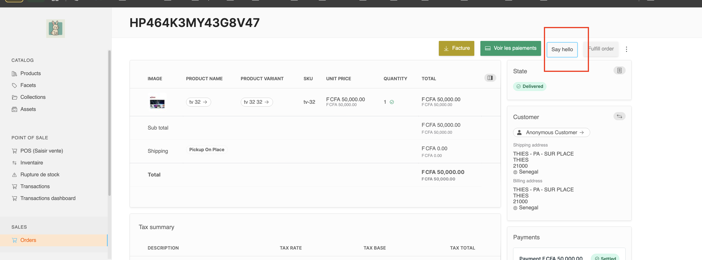

# install cnd-vendure-hello-plugin

```bash
npm i cnd-vendure-hello-plugin

```

```
\\1) add import path from 'path';

import {HelloPlugin} from "cnd-vendure-hello-plugin";

export const config: VendureConfig = {
		// .. config options
		plugins: [
		\\2) add plugin  
		  HelloPlugin.init({}),
		 
		},
		app: compileUiExtensions({
					outputPath: path.join(__dirname, '../admin-ui'),
					extensions: [
					\\3) add extension
						HelloPlugin.ui
					],
					devMode: IS_DEV,
				}),
			}),
		],
};```


# Btn hello on order detail page

http://localhost:4200/admin/orders/1

